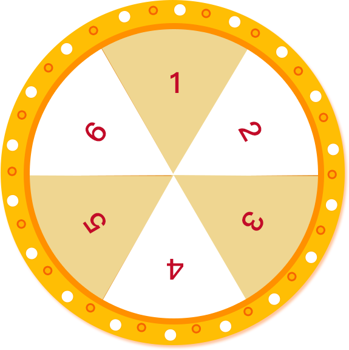

# 花1分钟写一个 抽奖页面


[演示地址](http://rili.iwto.cn/#/xzd/tool/choujiang)

## 1.首先你要有两张图片: 1转盘、2指针



## 2.布局
指针放到转盘正中间
html:
``` html
    <div class="father-div">
      
      
    </div>
```
css:
```html
<style lang="scss" scoped>
.father-div{
  width: 300px;
  height: 300px;
  margin: 37px auto;
  overflow: hidden;
  position: relative;
  .zp{
    transform: rotate(0deg);
    transition: transform 3s;
    width: 100%;
    height: 100%;
  }
  .zz{
    width: 80px;
    position: absolute;
    left: 110px;
    top: 110px;
  }
}
</style>
```

## 3.点击事件触发后,转盘旋转随机角度

```js
    startPlay() {
      this.r += rand(360 * 6, 360 * 12)
      this.$refs.img.style.transform = 'rotate(' + this.r + 'deg)'
    },
```


## 4.vue源码拿走不谢
```vue
<template>
  <div style="overflow: hidden;border:1px solid #fff">
    <div class="father-div">
      
      
    </div>

    <div style="margin: 20px;text-align: center">
      <van-button @click="startPlay">开始游戏</van-button>
    </div>

    <!--    <van-button v-if="status===2">开始游戏</van-button>-->
  </div>
</template>

<script>
import {Button} from 'vant'
import 'vant/lib/button/style'
import {rand} from "@/util/func";

export default {
  name: 'Choujiang',
  components: {
    [Button.name]: Button
  },
  data() {
    return {
      r: 0
    }
  },
  mounted() {

  },
  methods: {
    startPlay() {
      this.r += rand(360 * 6, 360 * 12)


      if ((this.r-30) % 60 <= 3) {
        this.r += 3
      }

      if ((this.r-30) % 60 >=57) {
        this.r -= 3
      }

      console.log((this.r-30)%60)


      this.$refs.img.style.transform = 'rotate(' + this.r + 'deg)'
    },
  }
}
</script>

<style lang="scss" scoped>

.father-div {
  width: 300px;
  height: 300px;
  border: 1px solid #fff;
  margin: 37px auto;
  overflow: hidden;
  position: relative;

  .zp {
    transform: rotate(0deg);
    transition: transform 3s;

    width: 100%;
    height: 100%;
  }

  .zz {
    width: 80px;

    position: absolute;
    left: 110px;
    top: 110px;
  }
}
</style>
```