## 假日 红色为假日

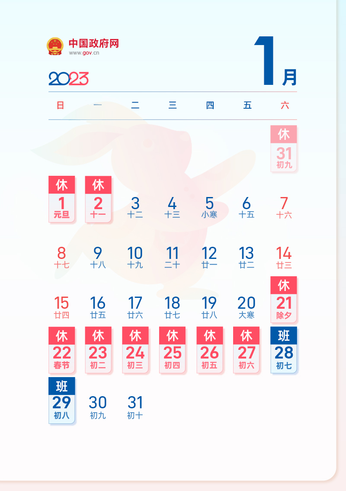
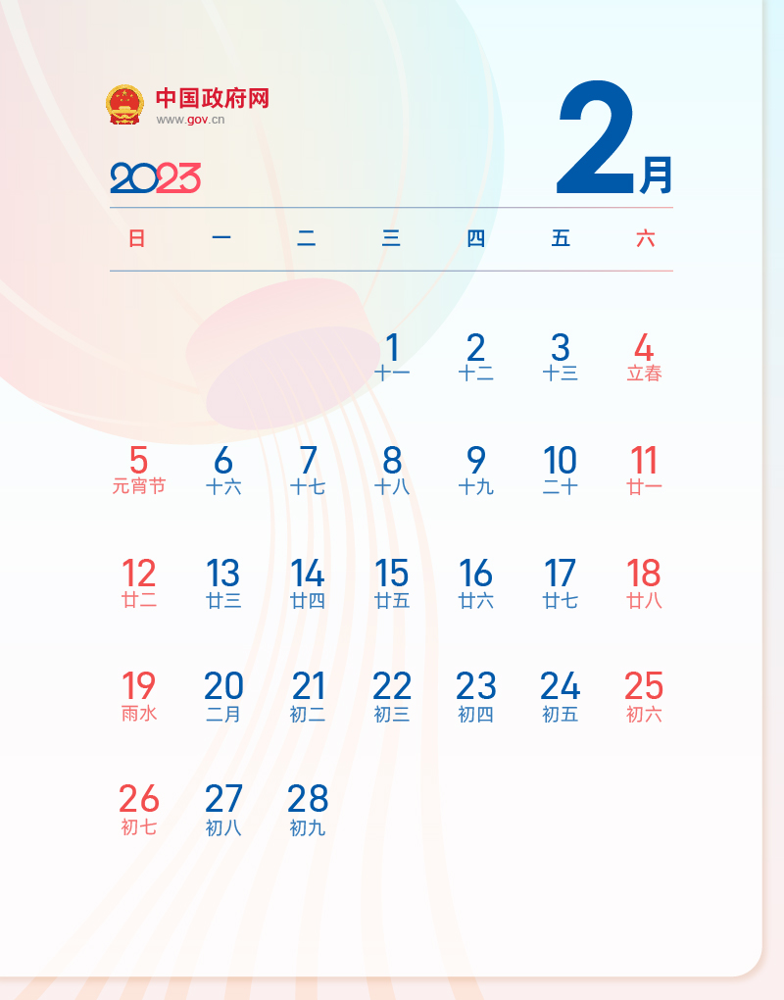
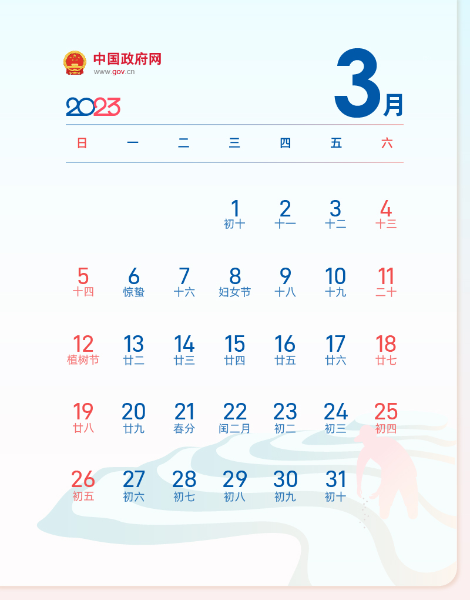
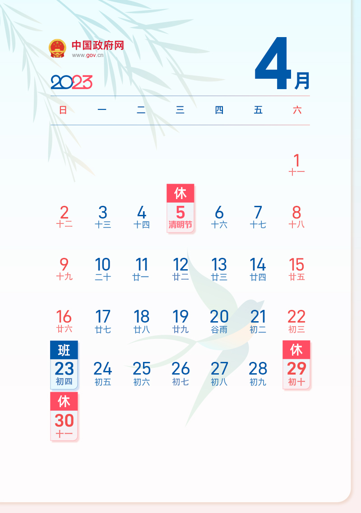
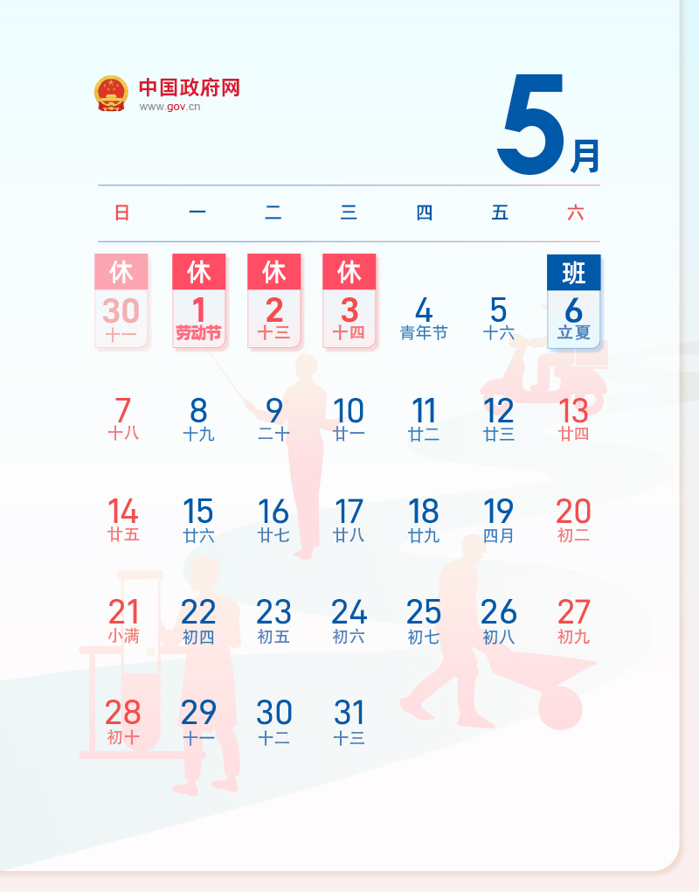
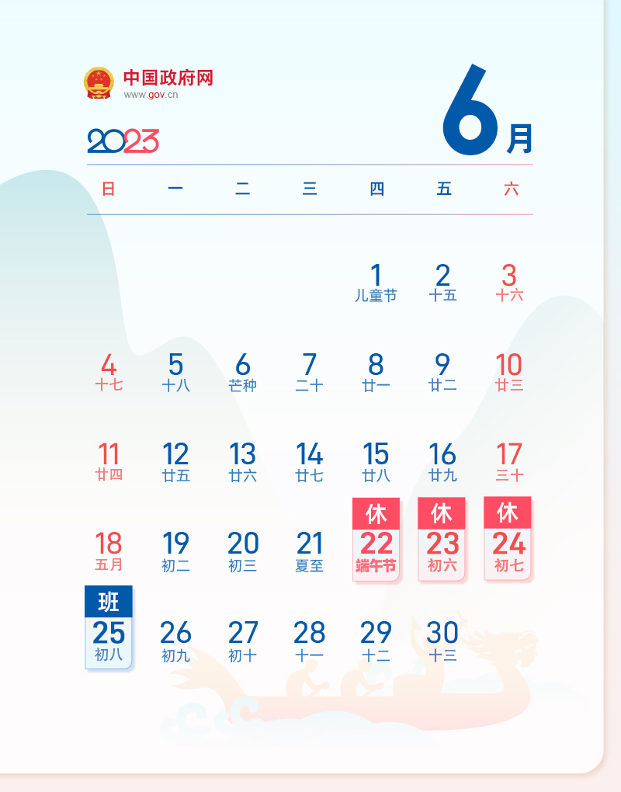
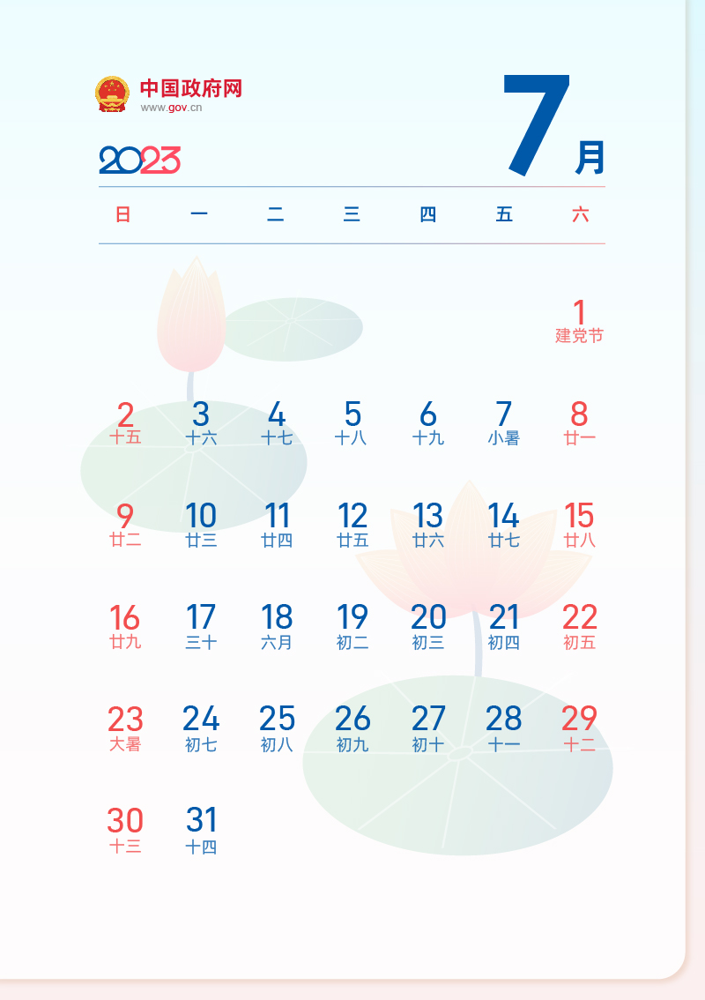
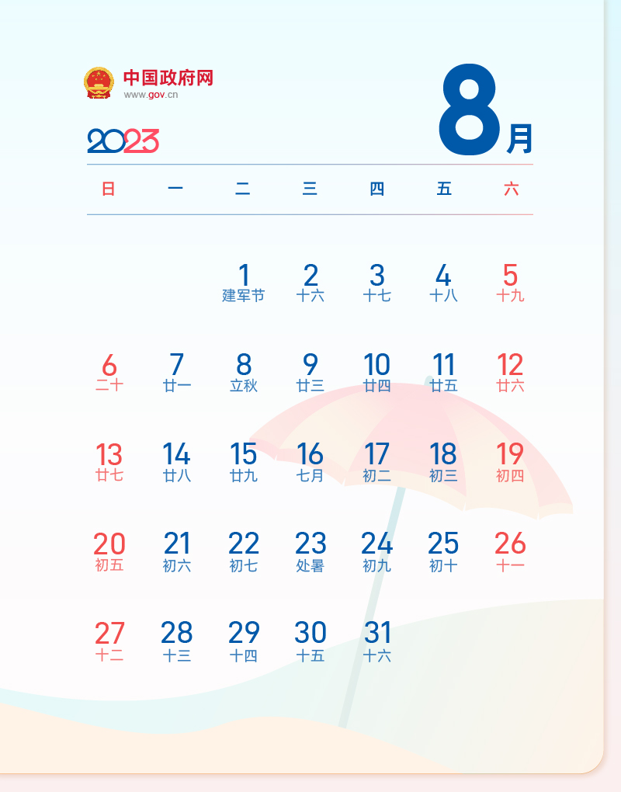
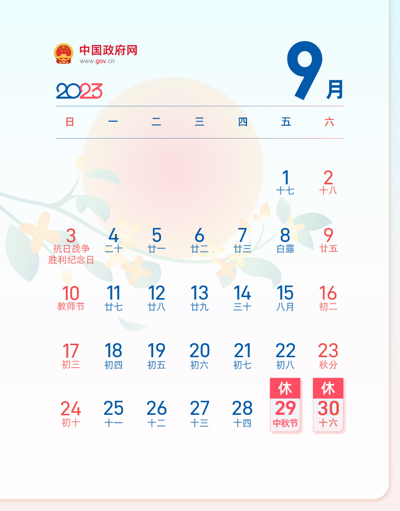
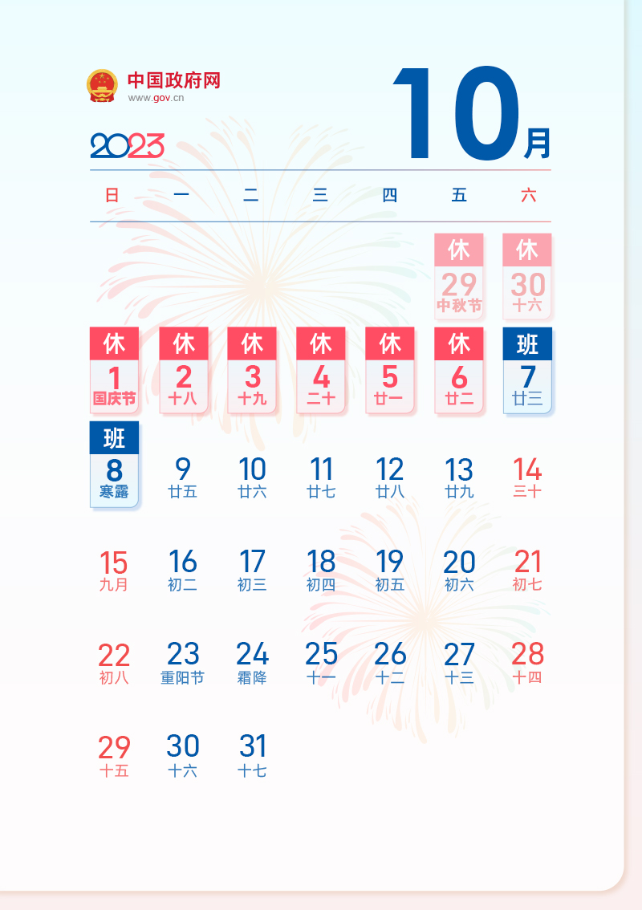
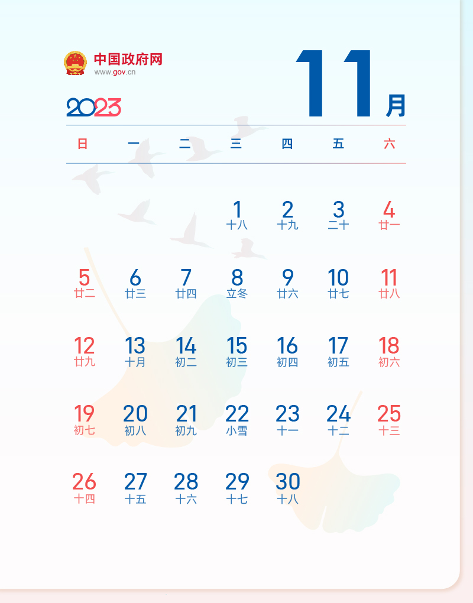
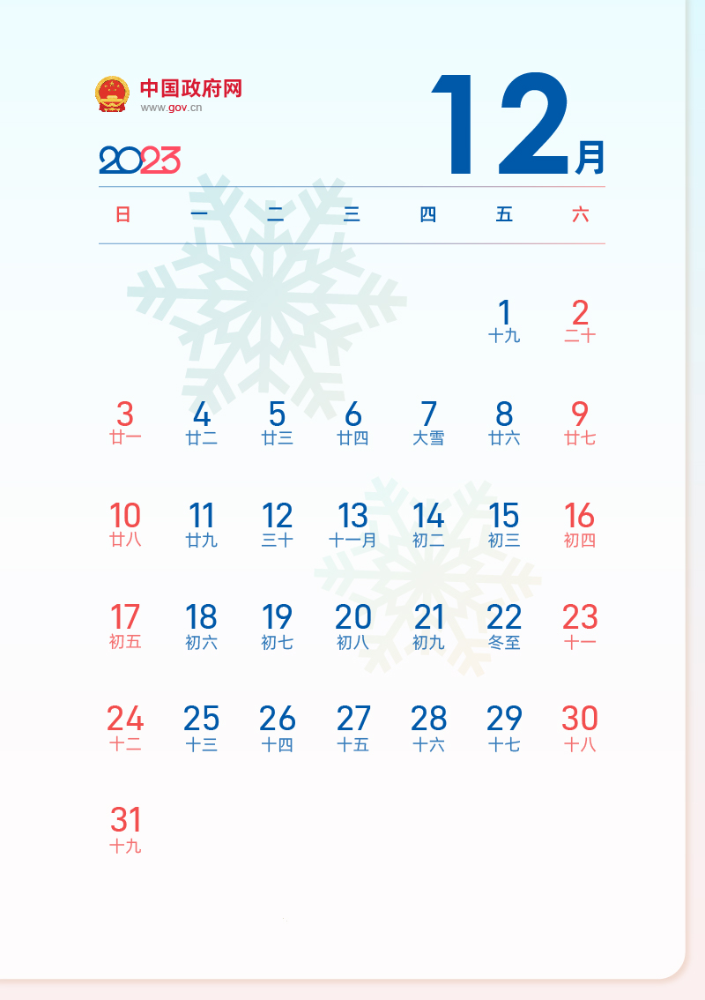

2023-01-01
2023-01-02
2023-01-07
2023-01-08
2023-01-14
2023-01-15
2023-01-21
2023-01-22
2023-01-23
2023-01-24
2023-01-25
2023-01-26
2023-01-27
2023-02-04
2023-02-05
2023-02-11
2023-02-12
2023-02-18
2023-02-19
2023-02-25
2023-02-26
2023-03-04
2023-03-05
2023-03-11
2023-03-12
2023-03-18
2023-03-19
2023-03-25
2023-03-26
2023-04-01
2023-04-02
2023-04-05
2023-04-08
2023-04-09
2023-04-15
2023-04-16
2023-04-22
2023-04-29
2023-04-30
2023-05-01
2023-05-02
2023-05-03
2023-05-07
2023-05-13
2023-05-14
2023-05-20
2023-05-21
2023-05-27
2023-05-28
2023-06-03
2023-06-04
2023-06-10
2023-06-11
2023-06-17
2023-06-18
2023-06-22
2023-06-23
2023-06-24

